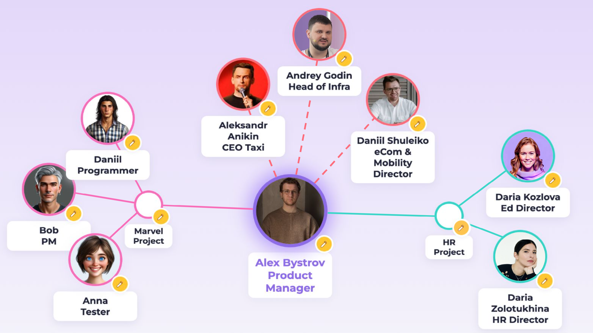

# AI MindMap — Визуальный AI-помощник для адаптации в команде

---

## 1. Проблема

В больших компаниях, на новых местах и в крупных проектах сотруднику сложно быстро запомнить коллег: их имена, роли, внешность, связи и принадлежность к отделам или проектам. Это мешает эффективному общению и командной работе, особенно в первые недели.  
**Результат:** теряется время на знакомства, возникают неловкие ситуации (“Кто это был на встрече?”), снижается скорость адаптации.

---

## 2. Решение с использованием LLM/ИИ

### Концепция:  
Создать веб-приложение, где пользователь легко строит визуальную "майндкарточку" своей команды:

- Добавляет коллег: имя, должность, проект/отдел.
- Кратко описывает внешность или загружает фото.
- AI-аватар: сервис генерирует портрет по описанию (например, “рыжий парень с бородой и очками”) на основе MonsterAPI (Stable Diffusion).
- Группирует людей по отделам/проектам, видит все связи на карте.
- Быстрый режим "флеш-карточек" перед встречей для запоминания.
- Возможности LLM: автозаполнение должностей, voice-to-text, подсказки по структуре.

---

## 3. Прототип решения

**Web-приложение (HTML/CSS/JS, MonsterAPI):**

- На главной странице — визуальный пример mindmap (см. ниже).
- Можно добавить нового коллегу, указать имя, должность, описание внешности, цвет, группу/связь.
- Для аватара — загрузить фото или сгенерировать AI-аватар по описанию.
- Drag&Drop для кружков (люди и группы), легко менять расположение.
- Быстрое редактирование: кнопка "карандаш" на каждом элементе.
- Мобильная и десктоп-адаптация.

**Превью, как это выглядит:**

---

## 4. Аналоги и уникальность

**Что ещё бывает:**
- Miro, MindMeister: визуальные карты, но нет людей, AI-аватаров и связей по отделам.
- Корпоративные HRM/CRM (Workday, SAP): оргструктура, но нет живой визуализации и генерации аватаров.
- Slack-боты (Donut): помогают знакомиться, но не дают визуальной карты.

**Преимущества нашего подхода:**
- Персонализированная карта связей и быстрый AI-аватар для каждого.
- Не нужно ждать обновления в HRM — пользователь сам строит свою карту.
- Режим "флеш-карточек" для подготовки к встречам.
- Широкие возможности расширения: интеграция с корпоративными базами, LLM-ассистент, голосовой ввод, автоматическое построение структуры.

---

## 5. Возможности и ограничения технологий

**Возможности:**
- Генерация аватаров по описанию (MonsterAPI / Stable Diffusion).
- LLM — автозаполнение, voice-to-text, подсказки.
- Web/JS — кроссплатформенность, адаптивность.
- Интеграция с корпоративными API, календарями, HRM.

**Ограничения:**
- Качество генерации зависит от промпта и модели.
- Бесплатные API часто имеют лимиты по количеству запросов.
- Для глубокой интеграции с корпоративной БД потребуется отдельный бэкенд и проработка безопасности.
- LLM не всегда корректно определяет редкие имена/должности.

---

## 6. Потенциал развития

- Интеграция с корпоративным порталом Яндекса, автозаполнение по базе сотрудников.
- Автоматический импорт команд из календаря.
- Режим подготовки к встрече (“флеш-карточки” участников).
- Рекомендации по знакомствам на основе структуры и проектов.
- Голосовой ввод и мобильный ассистент.

---

### Почему я выбрал такую задачу?

Проблема реальна для любого, кто часто меняет команды или проекты. Решение снижает стресс и повышает эффективность адаптации. Это отличная область для AI-экспериментов в большой компании — быстрый результат, высокая ценность для новых сотрудников и PM.

---

**Контакты:**  
Александр Бистров  
[GitHub: MrBistr](https://github.com/MrBistr)  
Email: [вставьте свой]  
Demo: [вставьте ссылку на демо]  
