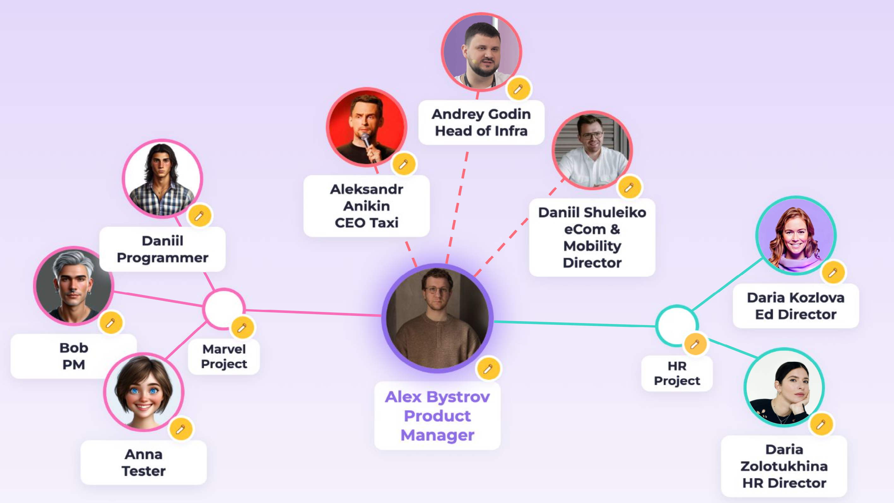

# YouSocialMap — Визуальный AI-помощник для адаптации в команде

## Проблема

В больших компаниях, на новых местах и в крупных проектах сотруднику сложно быстро запомнить коллег: их имена, роли, внешность, связи и принадлежность к отделам или проектам. Это мешает эффективному общению и командной работе, особенно в первые недели.

**Результат:** теряется время на знакомства, возникают неловкие ситуации (“Кто это был на встрече?”), снижается скорость адаптации.

## Решение с использованием LLM/ИИ

**AI MindMap** — визуальный веб-сервис, где пользователь может:

- Добавлять коллег (имя, должность, проект/отдел).
- Кратко описывать внешность или загружать фото.
- Генерировать AI-аватар по описанию (например, “рыжий парень с бородой и очками”) — интеграция с MonsterAPI (Stable Diffusion).
- Группировать людей по отделам/проектам, видеть связи на карте.
- Использовать режим "флеш-карточек" для подготовки к встречам.
- В перспективе — интеграция с корпоративной базой сотрудников и календарём (автозаполнение, подсказки, напоминания).

ИИ-компоненты:
- Генерация аватаров по описанию (MonsterAPI/Stable Diffusion).
- Возможности LLM для автозаполнения, voice-to-text, интеллектуальных подсказок.

## Прототип

- На стартовой странице — пример mindmap (см. выше).
- Можно добавить нового коллегу, указать имя, должность, описание внешности, цвет, связи/группу.
- Для аватара — загрузить фото или сгенерировать AI-аватар по описанию.
- Drag&Drop для кружков (люди и группы).
- Быстрое редактирование (кнопка "карандаш" на каждом элементе).
- Адаптация под мобильные устройства.

## Аналоги и уникальность

**Аналоги:**
- Miro, MindMeister — визуальные карты, но нет персонализации под команду и AI-аватаров.
- Корпоративные HRM/CRM (Workday, SAP) — оргструктура без живой визуализации и генерации портретов.
- Slack-боты (Donut) — помогают знакомиться, но не дают визуальной карты.

**Особенности решения:**
- Персонализированная карта связей и быстрый AI-аватар для каждого.
- Самостоятельное построение карты без ожидания действий HR.
- Режим "флеш-карточек" для подготовки к встречам.
- Возможность интеграции с корпоративными системами, LLM-ассистент, голосовой ввод.

## Технологии

- Генерация аватаров по описанию (MonsterAPI / Stable Diffusion).
- LLM — автозаполнение, voice-to-text, подсказки.
- Web/JS — кроссплатформенность, адаптивность.
- Возможность интеграции с корпоративными API, календарями, HRM.

**Ограничения:**
- Качество генерации зависит от промпта и модели.
- Бесплатные API имеют лимиты на запросы.
- Для глубокой интеграции с корпоративной БД потребуется отдельный бэкенд и проработка безопасности.

## Потенциал развития

- Интеграция с корпоративным порталом, автозаполнение по базе сотрудников.
- Автоматический импорт команд из календаря.
- Режим подготовки к встрече (“флеш-карточки” участников).
- Рекомендации по знакомствам на основе структуры и проектов.
- Голосовой ввод и мобильный ассистент.

---

**Почему я выбрал эту задачу?**  
Это реальный вызов для новых сотрудников и PM, особенно в больших компаниях и быстро меняющихся проектах. Решение помогает быстро адаптироваться и экономит время, минимизирует неловкие ситуации и делает команду ближе.

---

**Контакты:**  
Александр Бистров  
[GitHub: MrBistr](https://github.com/MrBistr)  
Demo: https://mrbistr.github.io/WhoIS3/ 
